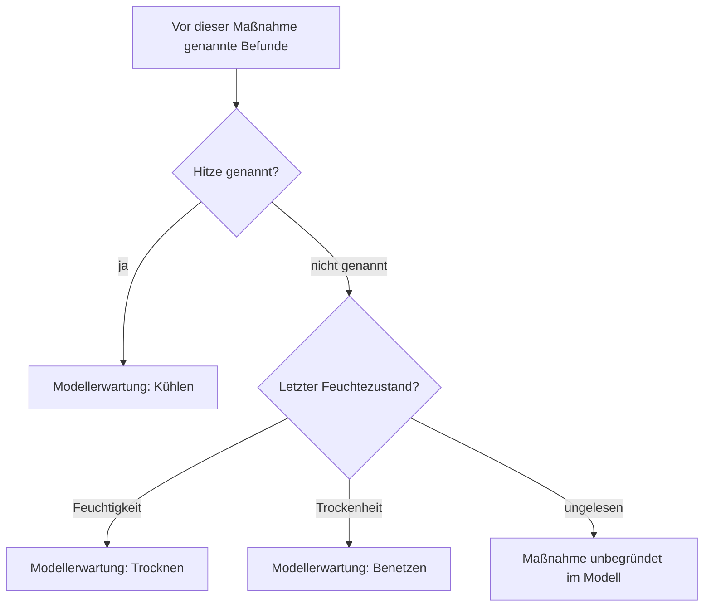

# P01 — Diagnosekapitel und reine Zustandsbeschreibung

Die sechs Befunde und drei Maßnahmen sind neu verfasste Ganzwortannahmen. Keine Patientendaten, diagnostizierten Krankheiten oder medizinisch begründeten Maßnahmen. Das Kapitel vergleicht eine erfundene Entscheidungslogik mit einer beschreibenden Lesung. Die beiden vollständigen Reader enthalten alle 145 Quellgruppen; 104 bleiben als unveränderte Wörter offen.

## Gemeinsamer Entscheidungsbaum

'Nicht genannt' ist keine ausdrückliche Abwesenheit des Befunds. Der Baum ist vom Forscher gesetzt, kein entziffertes Lehrschema. Schwellung, Schmerz und Absonderung beschreiben den Fall, verändern in diesem ersten Modell aber keinen Behandlungszweig. Das ist eine wesentliche Schwäche des angeblichen Differentialdiagnosekapitels, kein versteckter Erfolg dieser drei Wörter. Symbolische Grade A/B/C tragen noch keine identifizierte Schwereordnung oder Behandlungsdosis.

## f17r.4–6

D: Ein unbenannter Fall zeigt zunächst Feuchtigkeit. Später stehen die angenommenen Befunde Schwellung, Schmerz und Absonderung nebeneinander. Der entworfene Baum würde bei einer nachfolgenden Maßnahme Trocknen erwarten. Im gesamten Absatz kommt aber keines der drei Maßnahmenwörter vor. Ein Grad-A-Wort steht nach offenen Gruppen und bleibt ohne Befundbindung. Schluss und Behandlung fehlen; sie werden nicht aus dem Bild oder dem nächsten Absatz ergänzt.

R: Derselbe Fall wird mit Feuchtigkeit, Schwellung, Schmerz und Absonderung beschrieben. Die Zustandsbeschreibung braucht keinen Behandlungsschluss, erklärt aber die übrigen Wörter ebenfalls nicht. Alle drei cthy/chor/shor-Nennungen bleiben sichtbar, statt als drei verschiedene Diagnosen ausgegeben zu werden.

## f21r.8–12

D: Zuerst werden Benetzen und Trocknen gelesen, bevor irgendeiner der sechs gewählten Befunde genannt wurde. Beide Maßnahmen sind im Modell unbegründet. Erst anschließend folgen Schwellung und die zeitlich aktualisierte Folge Feuchtigkeit→Trockenheit→Feuchtigkeit, dann Hitze und Schmerz; zuletzt Trockenheit mit Grad C. Der Baum hält die Hitze weiterhin für entscheidend und erwartet Kühlen. Die angenommene Schlussmaßnahme chkaiin lautet aber Trocknen. Das widerspricht genau dieser Prioritätsregel.

R: „Ist benetzt; ist getrocknet“ beschreibt zwei Zustände, ohne eine vorausgehende Therapie zu behaupten. Danach dieselbe Befundfolge und am Ende „ist getrocknet“. Ihre zeitliche oder sachliche Gliederung bleibt offen. R spart die diagnostische Begründungspflicht, identifiziert dafür keine Ursache der Zustandswechsel. Feucht/trocken/feucht ist nicht allein durch die Readerfolge zu einem gelesenen Verlauf geworden.

## f32v.7–11

D: Die ersten vermeintlichen Maßnahmen Kühlen und Benetzen haben keinen der sechs gewählten Vorbefunde. Die früheren Maß-/Gradwörter sind nicht an Befunde gebunden. Später folgen Schmerz und Trockenheit mit Grad C; die Schlussmaßnahme sho=Benetzen stimmt nun mit dem gesetzten Zweig überein. Das ist die erste konkrete Befund→Schluss→Maßnahme-Kette dieses Entwurfs: Trockenheit .10:4, Grad C .10:5, Benetzen .11:2. Die Bedeutung dieser Wörter ist durch die passende Regel nicht unabhängig bestätigt.

R: Zunächst gekühlt und benetzt; später Schmerz und Trockenheit C; zuletzt benetzt. Diese Beschreibung kann dieselben Angaben enthalten, ohne einen diagnostischen Schluss zu behaupten. Die acht übrigen offenen Gradbindungen im Gesamtmaterial werden nicht durch vorweggenommene Befunde repariert.

## f29v.1–4

D: Absonderung und Schwellung, danach mehrfach Trockenheit und schließlich Hitze. qotchy .3:6 als Kühlen entspricht dem vorherigen shey .3:4 unter der festen Regel. Später wird Schwellung wieder genannt, aber kein neuer entscheidender Befund und kein neuer gebundener Grad. sho .4:8 als Benetzen trifft deshalb auf denselben bekannten Registerzustand, unter dem vorher Kühlen stand. Die letzte Maßnahme widerspricht der Regel.

Die mögliche Erklärung „Das erste Kühlen hat die Hitze inzwischen beseitigt“ wäre eine ungeschriebene Erfolgsannahme. Sie ist hier weder gelesen noch automatisch eingesetzt. Ebenso wenig darf eine neue Schwellungsnennung von sich aus einen neuen Patienten erzeugen.

R: Absonderung, Schwellung, trockene Zustandsnennungen, Hitze; anschließend „ist gekühlt“, später „ist benetzt“. Unterschiedliche Zustände können verschiedene Zeitpunkte oder Aspekte betreffen. R muss keine deterministische Behandlungswahl erklären, bleibt aber ohne gelesene Zeit-/Identitätsmarker ebenfalls partiell.

## Vollständiger Vergleich und Entscheidung

Acht Maßnahmenpositionen: zwei stimmen unter den Annahmen, zwei widersprechen der gesetzten Regel, vier haben keinen vorherigen entscheidenden Befund. Die beiden passenden Ketten sind verschieden begründet: Trockenheit→Benetzen und Hitze→Kühlen. Dass der gleiche Baum alle acht Fälle nicht trägt, verhindert eine Auswahl als diagnostisches Kapitel.

Alle 28 Fallpaare sind verglichen. Ein nichtleeres gleiches Modellregister hat verschiedene Maßnahmen, auf f29v. Die sechs Paare mit leerem Register sind keine sechs klinisch identischen Fälle; dort fehlen Angaben. Auch das nichtleere Register ist nur das Register der gewählten Wörter, kein vollständig erhobener wirklicher Befund.

Die festgelegte Diagnosefassung wird zurückgestellt, R als reine partielle Zustandsdarstellung erhalten. Keine neue Diagnose, kein bestätigtes Symptom, kein Schweregrad oder Behandlungsverb. Für die verbleibenden offenen Wörter wird keine zusätzliche Krankheit pro Absatz erfunden.
