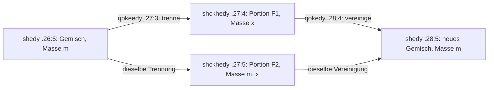

# Ein bedingter lokaler Rücklauf

0<x<m ist eine Modellbedingung. Die beispielhaften Zahlen 1→1/2+1/2→1 sind frei gewählte positive Bilanzzeugen, keine Voynich-Zahlen. F1 und F2 sind verschiedene Portionen derselben angesetzten Klasse, nicht zwei verschiedene Stoffarten. Das Ergebnis hat gleiche Gesamtmasse, nicht bewiesene chemische Gleichheit.

Die Gegenlesung I behält dieselben Schriftstellen und Operationen, aber die Vereinigung bekommt eigene Eingabeportionen F1′/F2′. Deren Masse muss nicht aus der vorherigen Trennung stammen. Die Schrift allein entscheidet diese Identitätsfrage hier nicht.

Die drei Einzelbilder und das gekoppelte untere Bild werden nur als bekannte grobe Gliederung festgehalten. Keine Pfeilrichtung dieses Schemas wurde aus einem Bild gewonnen. Keine Übertragung zwischen Records wird ergänzt. Im oberen P2 ist ferner eine vollständige Vereinigung→Trennung modelliert; das ist keine nachgewiesene Rückgewinnung der ursprünglichen Stoffe.
