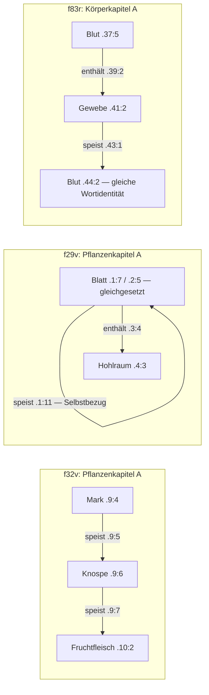

# Angenommenes Lehrschema und vollständige Ketten

A setzt gemeinsam speist(Quelle,Empfänger) und enthält(Behälter,Inhalt). Die Pfeile sind gerichtete hypothetische Aussagen, keine beobachteten Stoffflüsse. Alle drei vollständig gebundenen Zweierketten:

Keine der Pflanzenketten hat die Relationsfolge enthält→speist der Körperkette. H1 hat speist→speist, H2 speist→enthält und einen Selbstbezug. Geteilte Rollen allein ergeben also kein in beiden Kapiteln wiederholtes vollständiges Lehrmuster.

In D werden nur die beiden Pflanzenrelationen ersetzt: H1 Mark ist Teil von Knospe, Knospe ist Teil von Fruchtfleisch; H2 Blatt ist Teil von sich selbst, Blatt bedeckt Hohlraum. Der Selbst-Teil-Bezug ist unter der festen strikten Teilrelation ein Widerspruch. Die zusätzliche Körperstelle f83r.36:4 sagt in beiden Fassungen Gewebe enthält sich selbst. Das ist ebenfalls ein Widerspruch der festen Identitäts-/Relationsannahme. Die Zyklentabelle zählt dieselben Selbstkanten nochmals als graphische Zyklen, nicht als unabhängige Gegenbelege.

Alle sechs unvollständigen Kanten: f21r.12:7 rechts fehlt; f32v.8:2 rechts fehlt; f32v.8:3 links fehlt; f83r.2:6 rechts fehlt; f83r.3:5 links fehlt; f83r.54:1 beide fehlen. Keiner dieser Fälle wird durch das Lehrschema ergänzt.
