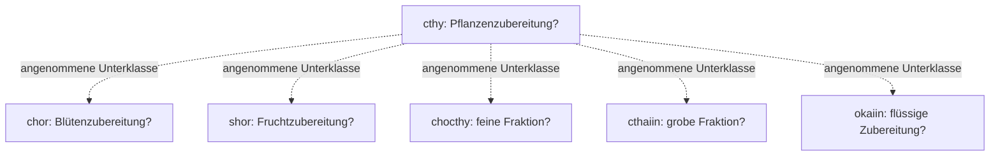

# P25 — vier mögliche Glossareinträge und ihre Listenrivalen

Alle Bedeutungen sind verfasste Hypothesen. Die unübersetzten Eintragsköpfe tcho/fcho/ksho/kooiin sind nur lokale Kennungen. Keine Pflanzenart wird benannt. Alle 145 Gruppen stehen unverändert und mit offenen Wörtern in READING_D.md und READING_L.md; diese Übersicht ersetzt jene nicht.

## tcho, f17r.4–6
D: „Tcho ist eine feuchte Pflanzenzubereitung; sie zählt zu den Blüten- und Fruchtzubereitungen.“ Die bekannte Folge cthy chor shor wird als drei sich überlagernde Klassifikationen gelesen. Das wäre etwa ein Mittel mit beiden Materialien, kein bewiesener botanischer Unterartenbaum. Die Wörter für „ist“, „zählt zu“ und die gemeinsame Bezugsbindung sind grammatische Annahmen, nicht entziffert.

L: „[feucht, noch ohne gebundenen Posten] … Pflanzenzubereitung; Blütenzubereitung; Fruchtzubereitung …“. Drei Posten, viele unübersetzte Nachträge. Die Feuchte steht vor dem ersten gewählten Klassenwort und bleibt in dieser Listenregel ungebunden. Keine still vorgezogene Zutat.

## fcho, f21r.8–12
D: „Fcho ist eine flüssige Pflanzen- und Blütenzubereitung; feucht, trocken, feucht … trocken im dritten Grad.“ Für denselben homogenen Zustand ist diese Attributfolge widersprüchlich. Keine versteckte Verfahrenszeit.

L: „Flüssige Zubereitung; Pflanzenzubereitung, feucht/trocken/feucht; Blütenzubereitung; Blütenzubereitung, trocken, drei Portionen.“ Die zwei Feucht/Trocken-Kontraste innerhalb desselben Pflanzenpostens bleiben bestehen; erst die neue chor-Nennung verschiebt den letzten Trockenwert auf einen anderen Posten. Mengenbindung an chol bezeichnet die Menge des so qualifizierten Postens; sie bestätigt keine Zahl. Die vielen offenen Wörter könnten andere Bindungen tragen, tun es in dieser Fassung aber nicht.

## ksho, f32v.7–11
D: „Ksho ist eine feine Fraktion dritten Grades und eine grobe Fraktion dritten Grades; außerdem eine trockene Blütenzubereitung dritten Grades.“ Fein/grob widerspricht der gewählten homogenen Definition. Dass ein zusammengesetztes Präparat beide Fraktionen enthalten könnte, ist eine andere, grundsätzlich mögliche Definition. Diese wäre strukturell näher an der Liste und löste die Frage nach 'ist eine Art von' nicht.

L: „Feine Fraktion: drei Portionen; grobe Fraktion: drei Portionen; Blütenzubereitung, trocken: drei Portionen.“ Dies bindet die gesamte bekannte Folge chocthy daiin cthaiin daiin an zwei verschiedene Posten mit gleicher Menge. Die Benennungen fein/grob sind bewusst neu gewählte Ganzwortannahmen; nicht aus cth oder anderen Bestandteilen abgeleitet. Der Zahlenwert drei ist ebenfalls unbestätigt. Die drei früheren daiin auf .8 bleiben ungebunden, einschließlich des Doppels. ctho wird nicht nachträglich mit cthy oder chocthy gleichgesetzt.

## kooiin, f29v.1–4
D: „Kooiin ist eine trockene Frucht-, Pflanzen- und flüssige Zubereitung.“ Wiederholte cthy/okaiin und chol werden als wiederholte Klassifikationen/Attribute desselben Gegenstands erhalten. Die Verbindung von Fruchtmaterial und flüssiger Zubereitung ist nicht ausgeschlossen; die Art des Verhältnisses bleibt offen. kooiin wird nicht als Wurzel übersetzt.

L: „Fruchtzubereitung; Pflanzenzubereitung, trocken, trocken; Pflanzenzubereitung, trocken, trocken; flüssige Zubereitung; Pflanzenzubereitung; flüssige Zubereitung.“ Die doppelten Trockenwörter bleiben zwei Nennungen, kein verstärkter Grad und kein zweiter Trocknungsschritt. Ein daiin vor den Trockenfolgen bleibt ungebunden. oty/otshy/oltchy und die übrigen Wörter werden nicht aus älteren Rezeptmodellen ergänzt.

## Sechs Begriffe, aber keine gelesene Hierarchie

Alle fünf Kanten sind gesetzt. TREE_EDGES.tsv nennt für jede sämtliche Kinderbelege und alle cthy-Belege in gemeinsamen Absätzen. Drei Kanten haben Absatzmitvorkommen, zwei nicht einmal das. Keine besitzt einen identifizierten Unterordnungsoperator. Die sechs paarweisen Vergleiche der vier Einträge unterscheiden zwar die gewählten Merkmalsmengen, doch diese Unterschiede sind ebenso mit verschiedenen Zutatenlisten vereinbar. Es gibt keinen Satz, dessen gelesene Syntax hier nur die Definition zulässt.

## Beschriftungsabschnitt f88r

Alle 15 Beschriftungen mit 16 ZL-Gruppen bleiben unter genau diesem Wörterbuch offen. Das betrifft auch die Mehrwortbeschriftung otor am; RF verbindet sie als otoram. osal hat die bekannte IT-Alternative oral. Keine Variante erhält einen neuen Wert. Ähnlichkeiten wie okol/okaiin oder otorchety/chor werden nicht zu Klassenbindungen gemacht. Der Versuch besitzt keine exakte Übertragungskapazität in diesem Abschnitt.
