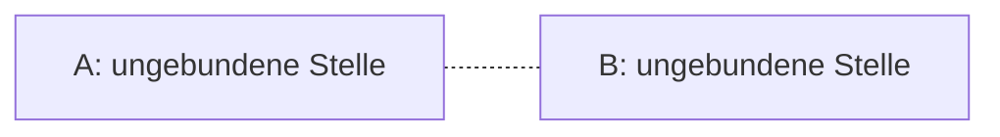
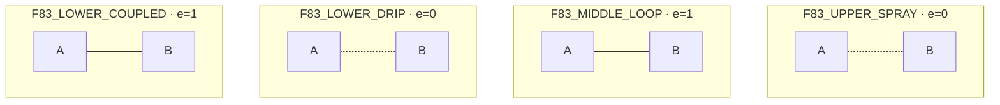
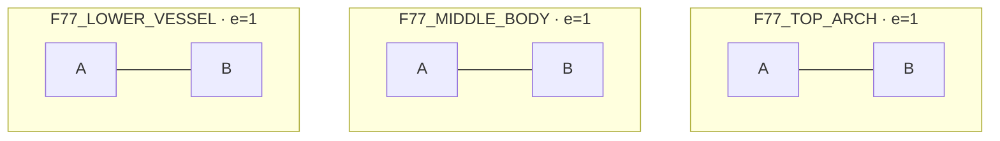
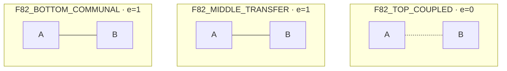

# P30 — aus D0 erzeugte Konfigurationen

Jeder Kasten zeigt ausschließlich die hypothetische A/B-Kante nach allen zugehörigen Records. Keine rekonstruierte Gesamtzeichnung.
A/B bleiben ungebundene Funktionsstellen. Eine gestrichelte Verbindung in diesen Diagrammen bezeichnet fehlende Kante, keine unsichere beobachtete Bildkante.
Alle nicht durch D0 erzeugten Bilddetails sind in VISION.md erhalten, nicht als passend vorausgesetzt.

## Gemeinsames Grundschema

Anfang: e(A,B)=0; Herstellen setzt1, Lösen setzt0. Beide Knoten bleiben erhalten.

## Tafel f83r

## Tafel f77r

## Tafel f82r

